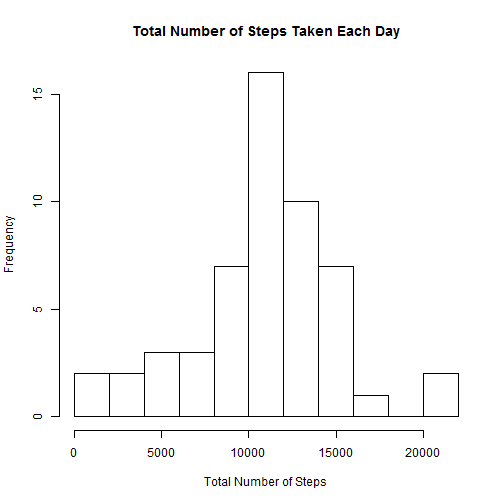
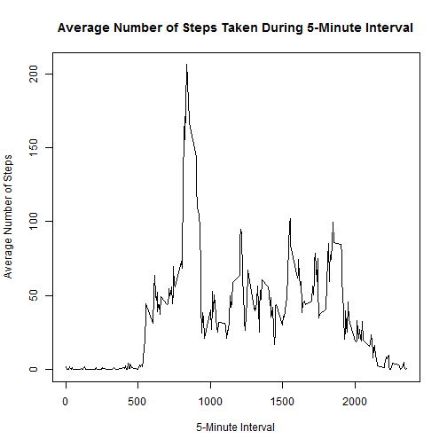
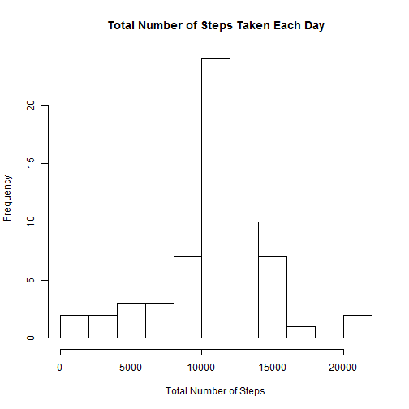
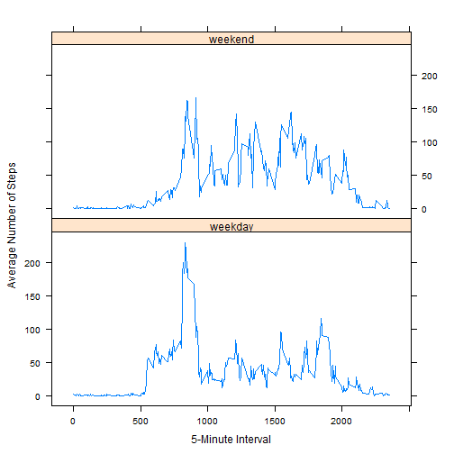

Peer Assessment 1
=================

We will be analyzing various aspects of the activity dataset assembled with data from a personal activity monitoring device.


## Loading and preprocessing the data:

Load the data:

```r
activity <- read.csv("activity.csv")
```


## What is mean total number of steps taken per day?

Note: Missing values were ignored.

Create a vector containing the total number of steps taken for each day:

```r
steps <- numeric()
index <- 1
for(each.day in as.data.frame(table(activity$date))[, 1]) {
  steps[index] <- sum(activity[activity$date == each.day, ]$steps)
  index <- index + 1
}
```

Create a histogram of the total number of steps taken each day:

```r
hist(steps, main="Total Number of Steps Taken Each Day", xlab="Total Number of Steps", breaks=8)
```

 

Calculate mean and median of number of steps taken each day:

```r
mean(steps, na.rm = TRUE)
```

```
## [1] 10766
```

```r
median(steps, na.rm = TRUE)
```

```
## [1] 10765
```


## What is the average daily activity pattern?

Create a vector containing the average number of steps taken during each 5-minute interval:

```r
all.intervals <- as.data.frame(table(activity$interval))[, 1]
all.intervals <- as.numeric(levels(all.intervals))[all.intervals]
index <- 1
interval <- numeric()
for(each.interval in all.intervals) {
  interval[index] <- mean(activity[activity$interval == each.interval, ]$steps, na.rm = TRUE)
  index <- index + 1
}
```

Plot 5-minute interval vs. average number of steps taken:

```r
plot(all.intervals, interval, main="Average Number of Steps Taken During 5-Minute Interval", xlab="5-Minute Interval", ylab="Average Number of Steps", type="l")
```

 

Find the 5-minute interval, which on average, contains the maximum number of steps:

```r
all.intervals[which(interval == max(interval))]
```

```
## [1] 835
```


## Imputing Missing Values

Calculate the total number of rows with `NA`:

```r
nrow(activity) - sum(complete.cases(activity))
```

```
## [1] 2304
```

Create new dataset and replace `NA` with mean for that 5-minute interval:

```r
every.interval <- data.frame(all.intervals, interval)
new.activity <- activity
index <- 1
for(each.step in new.activity$steps) {
  if(is.na(each.step)) {
    new.activity$steps[index] = every.interval[new.activity[index, 'interval'] == every.interval[, 1], 'interval']
  }
  index <- index + 1
}
```

Create new histogram for total number of steps taken each day using new dataset with `NA` replaced:

```r
# create vector with total number of steps taken for each day
new.steps <- numeric()
index <- 1
for(each.day in as.data.frame(table(new.activity$date))[, 1]) {
  new.steps[index] <- sum(new.activity[new.activity$date == each.day, ]$steps)
  index <- index + 1
}
# create histogram
hist(new.steps, main="Total Number of Steps Taken Each Day", xlab="Total Number of Steps", breaks=8)
```

 

Compute mean and median for new dataset:

```r
mean(new.steps)
```

```
## [1] 10766
```

```r
median(new.steps)
```

```
## [1] 10766
```

The mean remained the same, but the median increased by 1. The effect of imputing missing data based on our estimates is negligible.


## Are there differences in activity patterns between weekdays and weekends?

Determine which days are weekdays and weekends, then add column to dataset:

```r
dates <- as.Date(new.activity$date)
day.type <- weekdays(dates)
weekday.end <- character()
for(i in 1:length(day.type)) {
  if(day.type[i] == "Sunday" | day.type[i] == "Saturday") {
    weekday.end[i] <- "weekend"
  } else {
    weekday.end[i] <- "weekday"
  }
}
new.activity <- cbind(new.activity, weektype = as.factor(weekday.end))
```

Plot 5-minute interval vs. average number of steps taken:

```r
# separate weekend and weekday data
wkday.act <- new.activity[new.activity$weektype == 'weekday', ]
wkend.act <- new.activity[new.activity$weektype == 'weekend', ]
# create vector containing average number of steps taken for each 5-minute interval
wkday.all.intervals <- as.data.frame(table(wkday.act$interval))[, 1]
wkday.all.intervals <- as.numeric(levels(wkday.all.intervals))[wkday.all.intervals]
index <- 1
wkday.interval <- numeric()
for(each.interval in wkday.all.intervals) {
  wkday.interval[index] <- mean(wkday.act[wkday.act$interval == each.interval, ]$steps, na.rm = TRUE)
  index <- index + 1
}

wkend.all.intervals <- as.data.frame(table(wkend.act$interval))[, 1]
wkend.all.intervals <- as.numeric(levels(wkend.all.intervals))[wkend.all.intervals]
index <- 1
wkend.interval <- numeric()
for(each.interval in wkend.all.intervals) {
  wkend.interval[index] <- mean(wkend.act[wkend.act$interval == each.interval, ]$steps, na.rm = TRUE)
  index <- index + 1
}
# generate plot
library(lattice)
wkday.set <- data.frame(min = wkday.all.intervals, steps = wkday.interval, type = "weekday")
wkend.set <- data.frame(min = wkend.all.intervals, steps = wkend.interval, type = "weekend")
wk.set <- rbind(wkday.set, wkend.set)
xyplot(steps~min|type, data = wk.set, type = 'l', layout=c(1,2), xlab="5-Minute Interval", ylab="Average Number of Steps")
```

 
